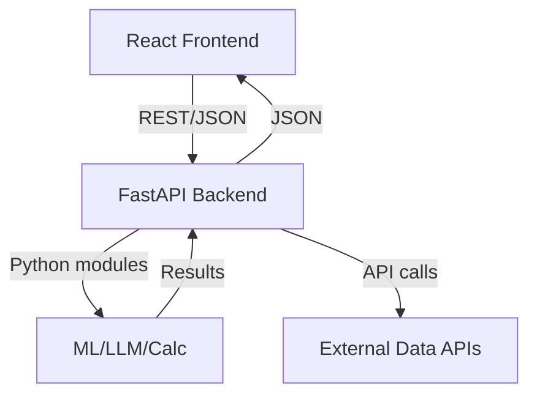

Here’s a refined and evidence-backed **step-by-step design spec** for your ML/LLM-powered real estate vs. stock investment side project, optimized for development in Cursor with React UI and interactive components.

---

## 🧠 Phase 1: Define Core Metrics & Data Models

**1.1 Essential Inputs & Outputs**

* **Inputs (via sliders/fields):** purchase price, down payment, loan terms, property tax, insurance, maintenance, vacancy rate, rent, appreciation rate, stock alternative return rate (e.g., S\&P 500 \~10%) ([Calculator.net][1], [NerdWallet][2])
* **Computed Outputs:**

  * Net Operating Income (NOI) = rent – operating expenses ([Zillow][3])
  * Cash Flow, Cap Rate = NOI / property value ([Zillow][3])
  * Cash-on-Cash Return, IRR, and NPV (with mortgage amortization; finance via discounted cash flows) ([Calculator.net][1])
  * Stock investment projection: simulate investment growth at a historical return of \~10% ([Medium][4], [NerdWallet][2])

**1.2 Data Sources**

* House price/rent trends per region via Zillow, Redfin, or MLS APIs
* Stock market benchmark data via finance APIs
* Validation/calibration using tools like Financial Mentor, Zillow, or Mashvisor calculators ([Mashvisor][5], [Reddit][6], [coffeeclozers.com][7])

---

## 🧪 Phase 2: Backend & Modeling in Cursor Notebooks

**2.1 Data Pipeline**

* Fetch historical rental data and stock returns; clean and preprocess
* Optionally train ML models (e.g., XGBoost) to forecast local rent/property growth

**2.2 Core Calculation Functions**

* Write Python modules for:

  * Amortization schedule & mortgage payments
  * NOI, Cash Flow, Cap Rate, Cash-on-Cash, IRR/NPV
  * Stock simulation over user-defined horizons

**2.3 LLM Integration**

* Wrap results in prompts:

  > “Input: … Results: cash flow \$X, IRR Y%, stock vs RE comparison. Output: natural‑language recommendation with risk notes.”
* Use domain-tuned LLM or general LLM with financial instruction tuning ([coffeeclozers.com][7], [arXiv][8], [Business Case Guy][9])

---

## 🖥️ Phase 3: React Frontend with Interactive UI

**3.1 Input Controls & State Management**

* Sliders, input boxes for financial variables
* Real-time state updates with React Context or Redux

**3.2 Visualization Components**

* Time-series chart comparing property cash flows, equity build-up, and stock investment
* KPI summary cards (Cap Rate, IRR, Cash-on-Cash, NPV)

**3.3 LLM Chat Module**

* Type-and-ask interface: “What if vacancy increases to 10%?”
* Backend sends current scenario + question; LLM responds with explanations

**3.4 Scenario Comparison Feature**

* Support multiple named scenarios (“base case”, “stress test”)
* UI: side-by-side comparison cards/charts

---

## 🧪 Phase 4: Integrations & Testing

**4.1 Backend API Setup**

* Use FastAPI or Flask; host calculation endpoints + LLM inference
* Optional: package into Docker / deploy serverless

**4.2 Testing**

* Unit tests: compare outputs with benchmarks or Financial Mentor/Zillow calculators ([NerdWallet][2])
* Integration tests: ensure slider adjustments recompute all downstream results

---

## 🚀 Phase 5: MVP Deployment & Monitoring

**5.1 MVP Definition**

* Interactive dashboard + LLM insights
* Deploy React frontend (Vercel/Netlify) and Python backend (Heroku/AWS/GCP)

**5.2 Beta Feedback Loop**

* Collect user data: scenarios created, questions asked, model satisfaction
* Improve UX, update input ranges, refine LLM prompt templates

**5.3 Model Monitoring**

* Track drift in forecasts vs. market data
* Periodic re-training calibration with recent data

---

## 🌟 Phase 6: Future Enhancements

**6.1 Portfolio Mode**

* Support multiple properties aggregation; combined IRR, equity, cash flows

**6.2 Advanced Forecasting**

* Integrate time-series ML (ARIMA/LSTM/XGBoost) for future rent, vacancies

**6.3 Explainability Layer**

* SHAP or similar explanation for rent/property growth drivers

**6.4 Monetization**

* Basic features free; premium features (portfolio mode, advanced forecasts) behind paywall

---

### 📋 Summary Roadmap

```markdown
1. Metrics & data definitions
2. Cursor notebooks: data + calc modules, LLM wrapping
3. React UI: sliders, charts, live results, chat
4. Backend API deployment + testing
5. MVP launch + user feedback
6. Add advanced forecasting, portfolio, paywall
```

By iteratively developing in Cursor and testing via notebooks, you retain control and visibility into models, calculations, and prompts. The React UI ensures a polished, interactive experience—complete with natural-language insights powered by LLMs.

[1]: https://www.calculator.net/rental-property-calculator.html?utm_source=chatgpt.com "Rental Property Calculator"
[2]: https://www.nerdwallet.com/article/investing/real-estate-vs-stocks-which-is-the-better-investment?utm_source=chatgpt.com "Real Estate vs. Stocks: Which Is the Better Investment? - NerdWallet"
[3]: https://www.zillow.com/rentals-network/rental-property-calculator/?utm_source=chatgpt.com "Rental Property Calculator | Zillow Rental Manager"
[4]: https://medium.com/the-investors-handbook/ultimate-guide-to-calculate-stock-market-vs-real-estate-returns-0ca2c9e2f40f?utm_source=chatgpt.com "Ultimate Guide To Calculate Stock Market vs. Real Estate Returns"
[5]: https://www.mashvisor.com/blog/rental-property-calculator-2022/?utm_source=chatgpt.com "Rental Property Calculator: What Is It For? | Mashvisor"
[6]: https://www.reddit.com/r/realestateinvesting/comments/zgapg0/calculator_for_stock_market_vs_real_estate_deal/?utm_source=chatgpt.com "Calculator for stock market vs real estate deal? : r/realestateinvesting"
[7]: https://www.coffeeclozers.com/blog/5-best-rental-property-calculators-for-real-estate-investors?utm_source=chatgpt.com "5 Best Rental Property Calculators for Real Estate Investors - Clozers"
[8]: https://arxiv.org/abs/2309.13064?utm_source=chatgpt.com "InvestLM: A Large Language Model for Investment using Financial Domain Instruction Tuning"
[9]: https://businesscaseguy.com/should-i-invest-in-real-estate-or-stocks/?utm_source=chatgpt.com "Real Estate vs Stock Market Returns – Investment/ROI Calculator"


Here’s a comprehensive plan for a web application that fulfills all requirements from your `instructions.md` for an ML/LLM-powered real estate vs. stock investment tool. This includes the **tech stack**, **architecture**, and **local deployment instructions**.

---

## 1. **Tech Stack Selection**

**Frontend:**  
- **React** (with Vite for fast dev/build)
- **TypeScript** (type safety)
- **Chakra UI** or **MUI** (modern, minimal, responsive UI)
- **Recharts** or **Victory** (for charts)
- **React Query** (for API state management)

**Backend:**  
- **FastAPI** (Python, async, easy ML/LLM integration)
- **Pydantic** (data validation)
- **Jupyter/Colab Notebooks** (for prototyping ML/LLM, not in production)
- **Uvicorn** (ASGI server)
- **Docker** (optional, for containerization)

**ML/LLM:**  
- **OpenAI API** or **local LLM** (for natural language recommendations)
- **XGBoost/Scikit-learn** (for forecasting, if needed)

**Data:**  
- **APIs:** Zillow, Redfin, Yahoo Finance (for real data, or mock for MVP)

---

## 2. **Architecture Overview**



- **Frontend:** User inputs, scenario management, charts, LLM chat.
- **Backend:** Handles calculations, ML/LLM calls, data fetching.
- **ML/LLM:** Provides recommendations, explanations.
- **External APIs:** For real estate/stock data.

---

## 3. **Feature Breakdown**

### **Frontend**
- Responsive, minimal dashboard (Chakra UI/MUI)
- Input sliders/fields for all financial variables
- Scenario management (save, compare)
- Real-time charts (property vs. stock)
- KPI summary cards
- LLM chat interface (“What if…”)
- Side-by-side scenario comparison

### **Backend**
- Endpoints for:
  - Financial calculations (NOI, Cap Rate, IRR, NPV, etc.)
  - Stock simulation
  - Scenario management
  - LLM prompt/response
- Optional: endpoints for fetching real data (Zillow, Yahoo Finance)
- ML/LLM integration (OpenAI or local)

---

## 4. **Project Structure**

```
rentio-app/
  frontend/
    src/
      components/
      pages/
      api/
      App.tsx
      main.tsx
    package.json
    vite.config.ts
  backend/
    app/
      main.py
      models.py
      calc.py
      llm.py
      requirements.txt
    Dockerfile
  README.md
  docker-compose.yml (optional)
```

---

## 5. **Local Deployment Instructions**

### **Prerequisites**
- Node.js (v18+)
- Python (3.10+)
- (Optional) Docker

---

### **Backend Setup**

```bash
cd backend
python3 -m venv venv
source venv/bin/activate
pip install -r requirements.txt
uvicorn app.main:app --reload
```

- **`requirements.txt`** example:
  ```
  fastapi
  uvicorn
  pydantic
  numpy
  scikit-learn
  xgboost
  openai
  huggingface-hub
  llama-cpp-python
  requests
  ```

### Local LLM Mode

The backend includes `local_llm.py` which uses `llama-cpp-python` to run a
quantized TinyLlama model on CPU. The first request to `/local_llm` downloads the
weights from Hugging Face into `backend/models/`. This approach keeps the code
modular so you can swap in larger models or GPU acceleration later.

---

### **Frontend Setup**

```bash
cd frontend
npm install
npm run dev
```

- **Runs on**: [http://localhost:5173](http://localhost:5173)
- **Configure API URL** in `.env` if needed.

---

### **(Optional) Docker Compose**

```yaml
# docker-compose.yml
version: '3'
services:
  backend:
    build: ./backend
    ports:
      - "8000:8000"
  frontend:
    build: ./frontend
    ports:
      - "5173:5173"
```
```bash
docker-compose up --build
```

---

## 6. **UI/UX Principles**

- **Minimal:** Use whitespace, clear typography, no clutter.
- **Modern:** Use Chakra UI/MUI themes, card layouts, smooth transitions.
- **Responsive:** Mobile-first breakpoints, flex/grid layouts.
- **Accessible:** Proper labels, contrast, keyboard navigation.

---

## 7. **Testing**

- **Backend:**  
  `pytest` for unit/integration tests (especially for financial calculations).
- **Frontend:**  
  `react-testing-library` for UI, `cypress` for E2E.

---

## 8. **Extending/Customizing**

- Add more ML models for forecasting.
- Integrate with real APIs for live data.
- Add authentication for user scenarios.
- Deploy to Vercel/Netlify (frontend) and Heroku/AWS (backend).
